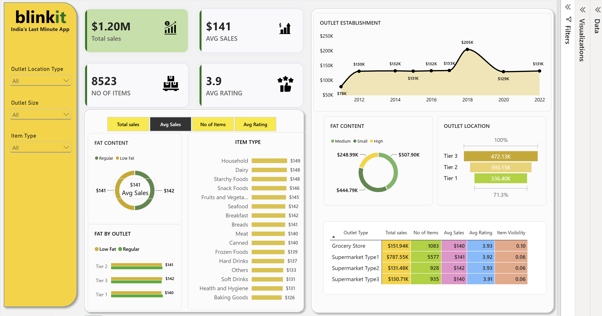

# Blinkit Sales Analysis Dashboard – Power BI

## Project Overview

This project presents an interactive **Blinkit Grocery Sales Analysis Dashboard** developed using **Microsoft Power BI**.

The dashboard analyzes grocery sales performance across different product attributes and outlet characteristics. It provides a consolidated view of key business metrics and enables users to explore sales performance through interactive filters and visualizations.

The analysis focuses on understanding sales performance by **item type, fat content, outlet type, outlet size, outlet location tier, and outlet establishment year**.

---

## Business Objective

The primary objective of this project is to analyze Blinkit's grocery sales data and identify meaningful patterns in sales performance.

The dashboard helps answer questions such as:

* What is the overall sales performance?
* Which item categories generate higher average sales?
* How does sales performance vary by outlet location?
* Which outlet sizes contribute most to total sales?
* How does sales change based on outlet establishment year?
* How does sales performance differ between low-fat and regular products?
* Which outlet types perform better?
* How do item visibility and customer ratings vary across outlet types?

---

## Tools & Technologies

* **Power BI** – Dashboard development and visualization
* **Power Query** – Data preparation and transformation
* **DAX** – KPI and analytical measure creation
* **Microsoft Excel** – Dataset/source data handling

---

## Dataset

The analysis is based on a grocery sales dataset containing information about products and outlets.

The major fields used in the analysis include:

### Product Attributes

* Item Type
* Item Fat Content
* Item Visibility
* Item Identifier
* Item Weight
* Item MRP

### Outlet Attributes

* Outlet Type
* Outlet Size
* Outlet Location Type
* Outlet Establishment Year
* Outlet Identifier

### Sales & Performance

* Sales
* Customer Rating

---

## Key KPIs

The dashboard contains the following major KPIs:

| KPI                 | Description                                              |
| ------------------- | -------------------------------------------------------- |
| **Total Sales**     | Overall sales generated across the analyzed data         |
| **Average Sales**   | Average sales performance                                |
| **Number of Items** | Number of items/products represented in the analysis     |
| **Average Rating**  | Average customer rating                                  |
| **Item Visibility** | Average/summarized visibility of products across outlets |

---

## Dashboard Features

### 1. KPI Overview

The dashboard provides high-level performance indicators including:

* Total Sales
* Average Sales
* Number of Items
* Average Rating

These KPIs provide an immediate overview of business performance.

---

### 2. Fat Content Analysis

A donut chart analyzes **Average Sales by Item Fat Content**.

Categories include:

* Low Fat
* Regular

This helps compare sales performance between different product fat-content categories.

---

### 3. Item Type Analysis

A bar chart analyzes **Average Sales by Item Type**.

This allows users to identify product categories with stronger or weaker sales performance.

---

### 4. Outlet Location Analysis

The dashboard analyzes sales across different outlet location tiers:

* Tier 1
* Tier 2
* Tier 3

A funnel visualization is used to compare sales performance across outlet location types.

---

### 5. Outlet Size Analysis

A donut chart compares **Total Sales by Outlet Size**.

This provides insight into how outlet size contributes to overall sales.

---

### 6. Sales Trend Analysis

A line chart analyzes **Total Sales by Outlet Establishment Year**.

This helps identify changes and trends in sales performance based on the year outlets were established.

---

### 7. Outlet Type Performance

A detailed matrix provides outlet-level analysis using:

* Total Sales
* Number of Items
* Average Sales
* Average Rating
* Item Visibility

This enables a more detailed comparison between different outlet types.

---

### 8. Interactive Filters

The dashboard contains interactive slicers that allow users to filter the analysis by:

* Outlet Location Type
* Outlet Size
* Item Type
* Selected analytical metric

All connected visuals update dynamically based on the selected filters.

---

## Key Analytical Areas

The dashboard provides analysis across the following dimensions:

```text
Product Analysis
       ↓
Item Type
Fat Content
Item Visibility

Outlet Analysis
       ↓
Outlet Type
Outlet Size
Location Tier
Establishment Year

Performance Analysis
       ↓
Total Sales
Average Sales
Number of Items
Average Rating
```

---

## Data Analysis Process

The project follows a typical Power BI data analytics workflow:

```text
Raw Dataset
     ↓
Data Preparation
     ↓
Data Transformation
     ↓
Data Modeling
     ↓
DAX Measures
     ↓
Interactive Visualizations
     ↓
Business Insights
```

---

## DAX Measures

The dashboard uses analytical measures for calculating important business KPIs, including:

* Total Sales
* Average Sales
* Number of Items
* Average Rating

The DAX measures used in the project are documented separately in the `DAX` folder.

---

## Dashboard Preview



---

## Repository Structure

```text
Blinkit-Sales-Analysis-PowerBI/
│
├── README.md
│
├── Dashboard/
│   └── BLINKIT_SALES_ANALYSIS.pbix
│
├── Dataset/
│   └── blinkit_grocery_data.xlsx
│
├── Screenshots/
│   └── Dashboard_screenshot.png
│
├── Documentation/
│   └── Blinkit_Sales_Analysis_Report.pdf
│
├── DAX/
│   └── measures.md
│
└── LICENSE
```

---

## How to Use

1. Download or clone this repository.
2. Open the `.pbix` file using **Microsoft Power BI Desktop**.
3. Interact with the available slicers and visuals.
4. Select different item types, outlet sizes, location tiers, and analytical metrics to explore the data.
5. Review the KPI cards and detailed outlet analysis for business insights.

---

## Skills Demonstrated

This project demonstrates practical skills in:

* Data Analysis
* Power BI
* Power Query
* DAX
* Data Visualization
* KPI Development
* Interactive Dashboard Design
* Business Intelligence
* Exploratory Data Analysis
* Business Insights

---

## Conclusion

The Blinkit Sales Analysis Dashboard transforms grocery sales data into an interactive business intelligence solution.

By combining KPI cards, analytical charts, interactive slicers, and detailed outlet-level analysis, the dashboard provides a clear view of sales performance and allows users to explore business performance from multiple perspectives.

---

## Author

**Mayank Gupta**

Data Analyst | Power BI | SQL | Excel | Python

---

## Project

**Blinkit Sales Analysis Dashboard**

Built with **Microsoft Power BI**
